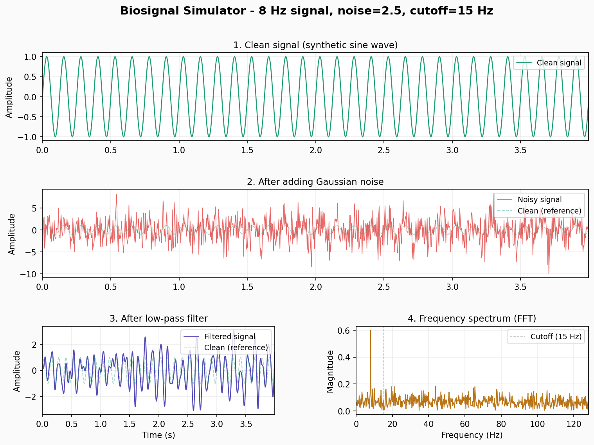

# Biosignal Simulator & Visualizer

A lightweight Python tool for simulating and visualizing biosignals with noise filtering.

---

## What It Does

Generates a synthetic EEG-style signal (sine wave), corrupts it with Gaussian noise, applies a Butterworth low-pass filter to recover the clean signal, and plots all stages alongside a frequency spectrum (FFT).

The parameters (frequency, noise level, filter cutoff, etc.) are all configurable at the top of the script for easy experimentation.



---

## Output

Running the script produces a 4-panel figure:

| Panel | Description |
|-------|-------------|
| 1 | Clean synthetic signal (sine wave) |
| 2 | Signal after Gaussian noise is added |
| 3 | Signal after low-pass filtering |
| 4 | Frequency spectrum (FFT) of the noisy signal |

Stats are also printed to the terminal:
```
Noise RMS error   : 2.4973
Filtered RMS error: 0.1821
Filter improvement: 92.7%
```

---

## Setup

```bash
git clone https://github.com/jem-zii/biosignal-simulator.git
cd biosignal-simulator
pip install numpy scipy matplotlib
python biosignal_sim.py
```

---

## Key parameters

Edit these at the top of `biosignal_sim.py`:

| Parameter | Default | Description |
|-----------|---------|-------------|
| `duration` | 4 | Signal length in seconds |
| `fs` | 256 | Sampling rate (Hz) — matches typical EEG hardware |
| `freq_hz` | 8 | Signal frequency (8 Hz = alpha brain wave band) |
| `noise_level` | 2.5 | Gaussian noise scale |
| `cutoff_hz` | 15 | Low-pass filter cutoff frequency |
| `filter_order` | 4 | Butterworth filter sharpness |

